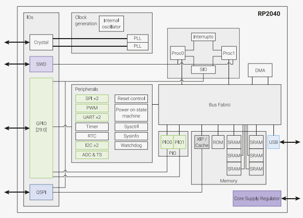

# RP2040 Breakout

# What Is It?
RP2040 is a microcontroller designed through Raspberry Pi.
It's key features include: 
- Dual ARM Cortex-M0+ @ 133MHz
- 264kB on-chip SRAM in six independent banks
- Support for up to 16MB of off-chip Flash memory via dedicated QSPI bus
- DMA controller
- Fully-connected AHB crossbar
- Interpolator and integer divider peripherals
- On-chip programmable LDO to generate core voltage
- 2 on-chip PLLs to generate USB and core clocks
- 30 GPIO pins, 4 of which can be used as analogue inputs
- Peripherals
    - 2 UARTs
    - 2 SPI controllers
    - 2 I2C controllers 
    - 16 PWM channels 
    - USB 1.1 controller and PHY, with host and device support 
    - 8 PIO state machines

We are using 2 RP2040 microcontrollers. One Microcontroller is an in-circuit programmer while the other one is for the application.  
# USB ports
- Data and power
- Power 

We have implemented two USB ports to prevent the board from drawing power from the computer, and to draw power from a power supply. The other USB port will be used for communication with the computer.

**Power MUX**: allows for the switching between USB ports. Feeds into a 3.3 volt SMPS regulator.

# LEDs 
- APA102C - programmable LEDs used for status indication

